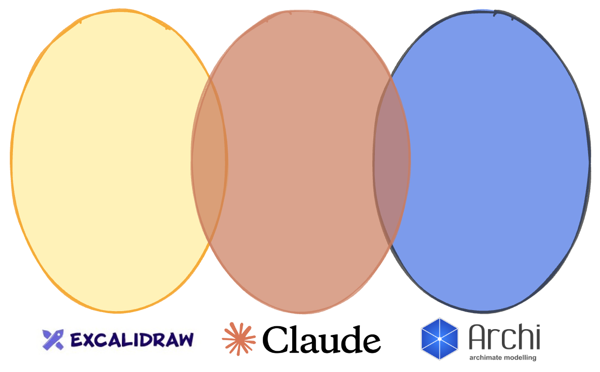

# Excaliarch
Excaliarch is a set of tools and methods that use Excalidraw to create, maintain, and exploit Archimate content.

## Rationale and Scope

The goal of the Excaliarch is to speed up and improve the accuracy of archimate models and their resulting deployments. 

Spoiler: excaliarch relies on Claude 4 sonnet to convert archimate content in excalidraw to runnable software.

Ultimately, we hope Excaliarh will cover the deloyment of any software resources or data assets that you can model in Archimate, but initially we focus on services to support data and integration products, namely:
 - physical schemas for persistent stores
 - the data that goes in the persistent stores
 - APIs

## Quick-start demo

1. Pre-requisites
  1. excalidraw + template
  2. archimate instructions
  3. deployment target and matching configuration file
  4. Claude 4 with *this* prompt file
5. excalidraw
6. open the demo file
7. setup the deployment target (postgres?  swagger?)

## Guidelines

See also the [Excaliarch Usage Guidelines](excaliarch-template-guidelines.md) for more information on using the template.

## Claude Code skill

The repo ships a Claude Code skill at [`.claude/skills/excaliarch/`](.claude/skills/excaliarch/) that reads Excaliarch-template `.excalidraw` files and lifts them into an ArchiMate-domain JSON model — concepts, relationships, and annotations — that an agent can reason over directly.

See [SKILL.md](.claude/skills/excaliarch/SKILL.md) for the trigger conditions, the labelling convention the reader expects, and how to invoke `reader.py`. Known gaps and follow-ups are tracked in [TODO.md](.claude/skills/excaliarch/TODO.md). v1 is read-only; the writing direction is planned.

### Artefacts (git)
 - pictures
 - excalidraw
 - physical schemas

 

