# Excaliarch Template Usage Guidelines

Excaliarch is a set of tools and methods that use Excalidraw to create, maintain, and exploit Archimate content.  Use the excaliarch-template-<version>template to quickly construct Archimate 3.1 compliant models that can also be used with Excaliarch code generation tools.

## How to access

 >>> access from excalidraw
 >>> download from here

## Modelling and Notation

### Naming

To get better results from the Excaliarch agent, keep the element type in the name.  The agent will quickly be able to identify which objects are which types.

For example, if you have an API Gateway service, call it "App Service: API Gateway Service".

### Relationships

Excalidraw can support all [Archimate 3.1 relationships](https://pubs.opengroup.org/architecture/archimate31-doc/chap05.html#_Toc10045332) out of the box!

Excalidraw templates do not contain objects with lines only, so use the in-built line drawing features to depict Archimate relationships between elements.

| Image (Relationship) | Description |
| -------------------- | ----------- |
| 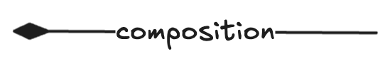  | Represents that an element consists of one or more other concepts.   |
| 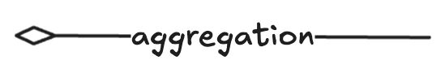  | Represents that an element combines one or more other concepts.   |
| 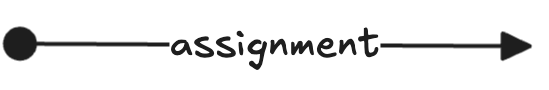  | Represents the allocation of responsibility, performance of behavior, storage, or execution.  |
| 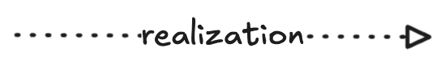  | Represents that an entity plays a critical role in the creation, achievement, sustenance, or operation of a more abstract entity.   |
| 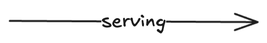  | Represents that an element provides its functionality to another element.   |
| 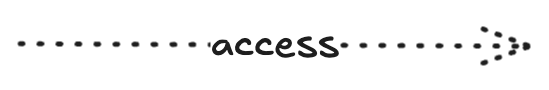  | Represents the ability of behavior and active structure elements to observe or act upon passive structure elements.   |
| 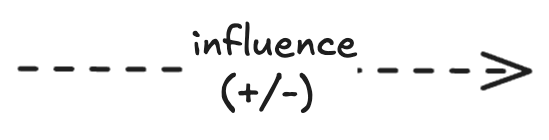  | Represents that an element affects the implementation or achievement of some motivation element.  |
| 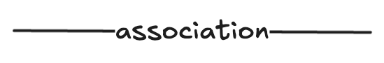  | Represents an unspecified relationship, or one that is not represented by another ArchiMate relationship.   |
| 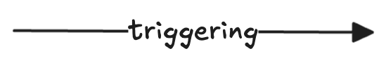  |  Represents a temporal or causal relationship between elements.   |
| 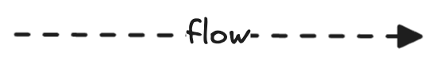  | Represents transfer from one element to another.   |
| 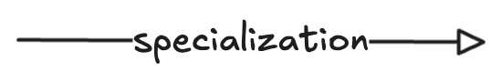  | Represents transfer from one element to another.   |
| 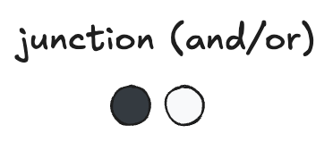  |   Used to connect relationships of the same type.   |

## Validation

TBD - TBD..

## Agent Model Interpretation

TBD - The agent should be able to interpret valid models out of the box

## Model Export to the metadata store

TBD - MCP?

 

